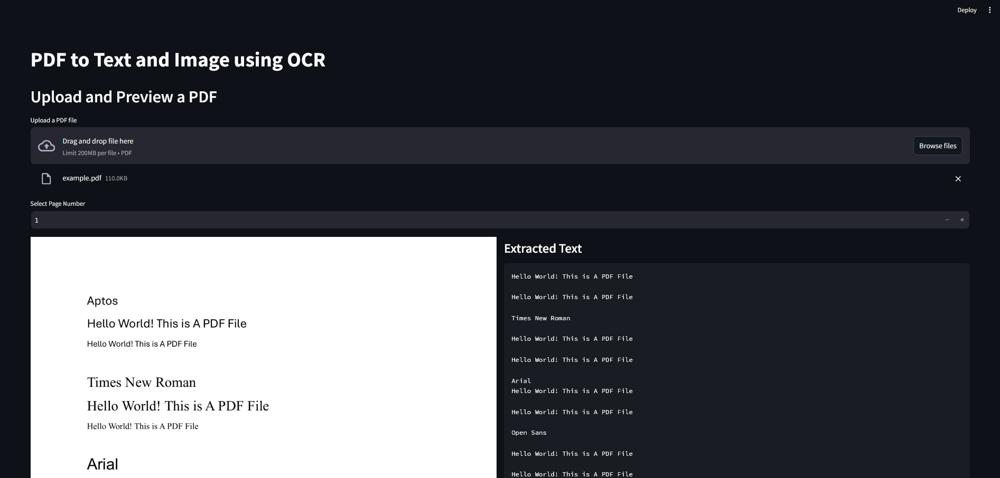

# PDF2TXT-IMG

This Project will convert PDF file into image (downloadable) and write the text in the file using Tesseract OCR 

## Getting Started
### Prerequisites
To run this program, you need to install these:
1. [Python](https://www.python.org/downloads/) (This project using ver. [3.11.10](https://www.python.org/downloads/release/python-31110/))
2. [Streamlit](https://streamlit.io/) (This project using ver. 1.40.1)
3. [Poppler](https://github.com/oschwartz10612/poppler-windows/releases/)  (This project using ver. [24.08.0](https://github.com/oschwartz10612/poppler-windows/releases/))
4. [Tesseract](https://github.com/tesseract-ocr/tesseract/releases/download/5.5.0/tesseract-ocr-w64-setup-5.5.0.20241111.exe) (This project using ver. 5.5.0.20241111)

### Installing
#### Setting up Dependencies
First, you can install requiered dependencies by running

```bash
pip install -f requirements.txt
```
or  
```bash 
pip install pdf2image PyPDF2 pytesseract streamlit
```

#### Setting up Poppler
Install and extract poppler in a location, example:

`C:\Program Files\poppler-24.08.0` 

Then, change the code with actual path:

```python
POPPLER_PATH = "C:\\Program Files\\poppler-24.08.0\\bin"
```

Note: You can adjust the version and the path

#### Setting up Tesseract
Install and make sure Tesseract has been installed on your device. Then, change the code with actual path: 

```python
# Current Project using OCR Windows 64 bit version 5.5.0.241111
# See: https://github.com/UB-Mannheim/tesseract/wiki 
pytesseract.pytesseract.tesseract_cmd = "C:\\Program Files\\Tesseract-OCR\\tesseract.exe"
```

## Run the Program

To run the program, just use this command:

```bash
streamlit run app.py
```

## What This Code Do?
1. Read a PDF file from Streamlit
2. Save the PDF file as temporary file
3. Read the temporary file as images
4. Display the image, you may download the image
5. Read image using Tesseract-OCR
6. Write the extracted text 

## Example
1. The image of no PDF file uploaded

2. The image of [PDF File](example/example.pdf) uploaded with [TXT Output](example/output.txt) and [Image Output](example/page_1.png)


## Colaborator
<table>
<tr>
<td align="center">
<a href="https://github.com/Windiarta">
<br>
<sub>
<b>Windiarta</b>
</sub>
</td>
</tr>
</table>

